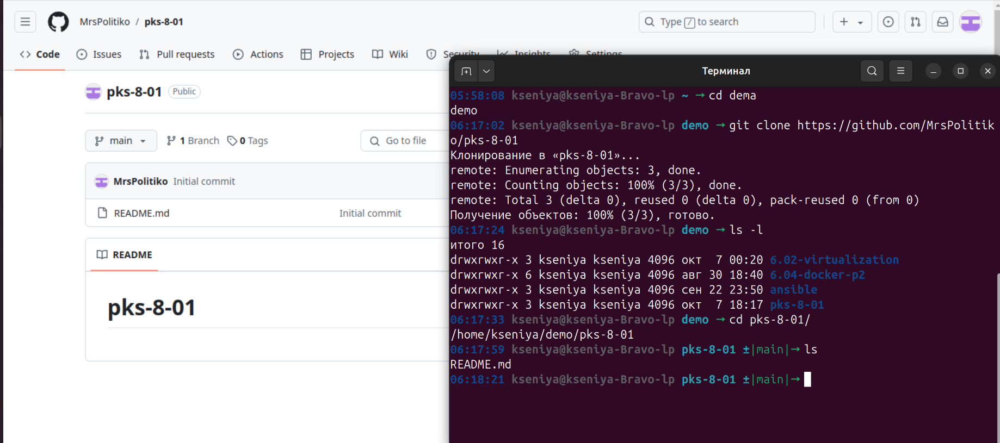

# Домашнее задание к занятию "`Git`" - `Политико Ксения`

---

### Задание 1

[Ссылка на коммит](https://github.com/MrsPolitiko/pks-8-01/commit/fb1beab92728c87aefe6bf89d5ab537d2cdfae63)

---

### Задание 2

[Ссылка на коммит](https://github.com/MrsPolitiko/pks-8-01/commit/bc13a82c67ed5f6abac813bc78f7c85110ad92e6)

---

### Задание 3

[Ссылка на дерево](https://github.com/MrsPolitiko/pks-8-01/network)

---

### Задание 4*

